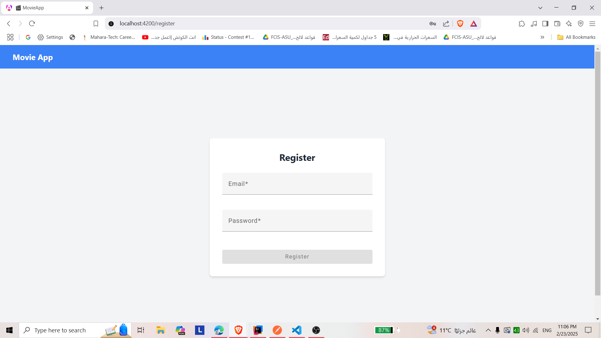
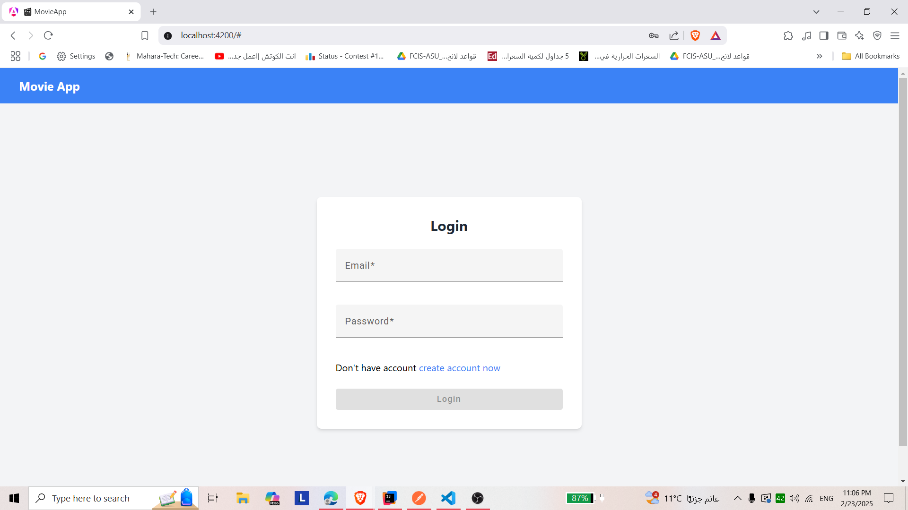
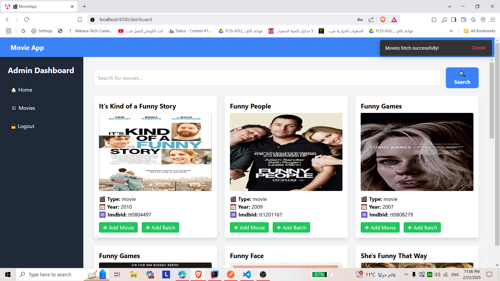
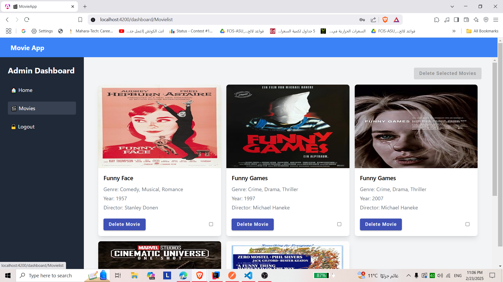
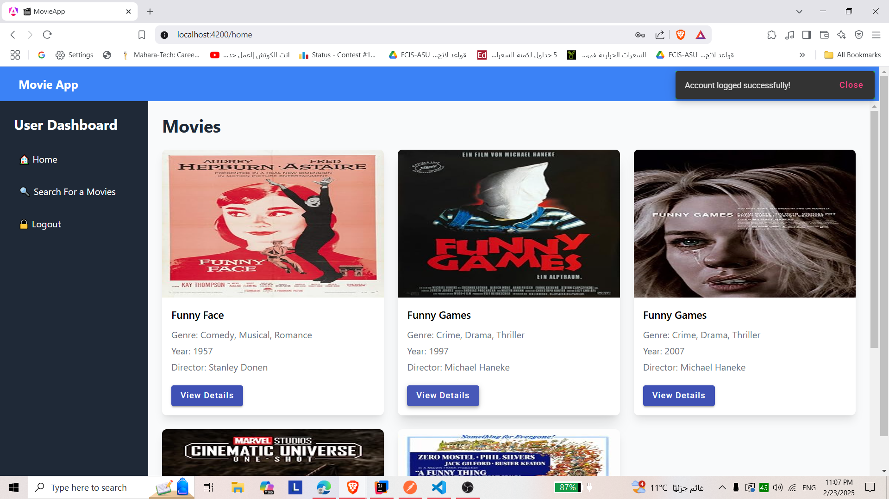
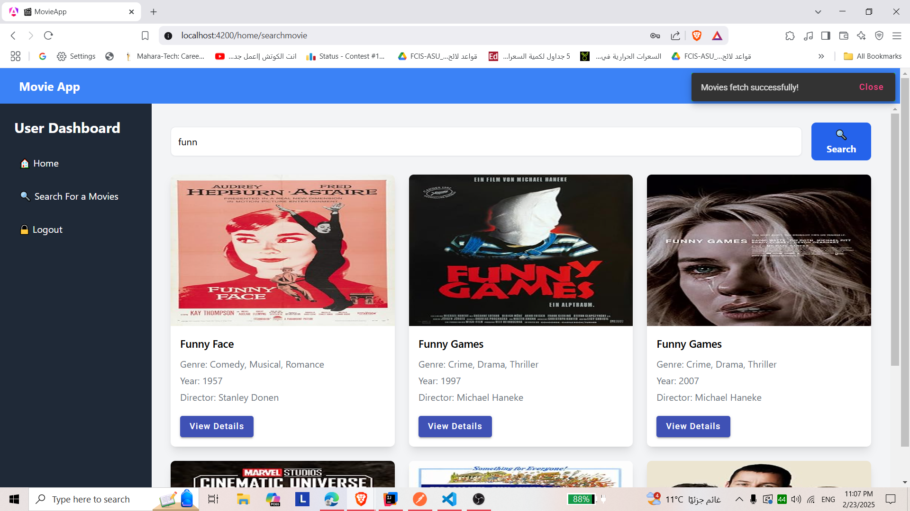

# 🎬 Movie Management Application

This **Full-Stack Movie Management Application** allows **admin users** to manage movies from the **OMDB API** and **regular users** to view, search, and rate movies.

---

## 🌟 Features

### ✅ **Admin Dashboard**

- 🔐 **Login:** Secure admin authentication.
- 🔍 **Search Movies:** Fetch movies from the OMDB API.
- ➕ **Add/Remove Movies:** Manage movies in the database.
- 📚 **Batch Operations:** Add or remove multiple movies.
- 📦 **Pagination:** Smooth navigation through movie lists.

### 👥 **User Dashboard**

- 🔐 **Login:** Secure user authentication.
- 🎬 **View Movies:** Browse movies added by the admin.
- 🔍 **Search:** Find specific movies by title.
- ⭐ **Rate Movies:** Users can rate each movie.

---

## 🛠️ Tech Stack

| **Technology**  | **Description**                     |
| --------------- | ----------------------------------- |
| 🟢 **Frontend** | Angular 16+, TypeScript, Bootstrap  |
| 🚀 **Backend**  | Spring Boot 3+, Java 8+, Hibernate  |
| 📀 **Database** | PostgreSQL                          |
| 🎥 **API**      | [OMDB API](https://www.omdbapi.com) |
| 🔐 **Security** | Spring Security, JWT Authentication |

---

## 📸 Screenshots & Demo
### 🔐 **Register page**

### 🔐 **Login page**


### 🌟 **Admin Dashboard**


### 🎬 **User Dashboard**


## 📦 Installation & Setup

### 📥 1. Clone the Repository

```bash
git clone https://github.com/yourusername/movie-management-app.git
cd movie-management-app
🖥️ 2. Application Setup

1.Configure PostgreSQL in application.properties:
spring.datasource.url=jdbc:postgresql://localhost:5432/movie_db
spring.datasource.username=your_db_username
spring.datasource.password=your_db_password
spring.jpa.hibernate.ddl-auto=update
spring.jpa.show-sql=true
omdb.api-key=YOUR_OMDB_API_KEY
2.Build and Run the Application:
mvn spring-boot:run
3.Install Frontend Dependencies:
npm install
4.Set OMDB API Key in environment.ts:
export const environment = {
  production: false,
  omdbApiKey: 'YOUR_OMDB_API_KEY',
  apiBaseUrl: 'http://localhost:8080/api'
};
5.Run the Angular App:
ng serve
🚀 Usage
Admin Login:
Email: admin@example.com
Password: admin123
User Login:
Email: user@example.com
Password: user123
Application URLs:
Frontend: http://localhost:4200
📀 Database Setup (PostgreSQL)
1-Ensure PostgreSQL is running and create a database:
CREATE DATABASE movie_db;
💡 Built with ❤️ using Angular, Spring Boot, and PostgreSQL!
